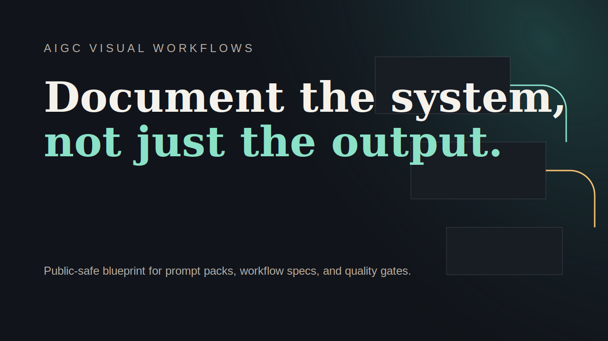

# aigc-visual-workflows

[English Version](./README.md)

这个仓库是我用来整理 AIGC 视觉工作流定义的地方。

我希望工作流不只是停留在截图、聊天记录或者零散文件夹里，所以这里会把每条工作流写清楚：它要解决什么问题、需要什么输入、依赖什么栈，以及在我看来什么样的质量检查才算过关。

## 包含内容

- 一个用来浏览工作流分类的小型静态页面
- 放在 `workflows/` 里的工作流 JSON 定义
- 用来检查字段完整性的校验脚本
- 一套适合记录模型栈和质检逻辑的结构

## 当前工作流方向

- 商品详情图
- lookbook 场景搭建
- 品牌分镜与故事板规划

## 我为什么这样整理工作流

AI 视觉工作如果只存在于截图、节点截图或者散乱笔记里，后面几乎没法稳定复用。我更习惯把它整理成这种形式：

- 先定义用途
- 把输入写清楚
- 记录模型和节点栈
- 写下质量检查点
- 按输出类型把工作流归类

## 命令

```bash
npm run validate:workflows
```

## 仓库结构

- `workflows/` JSON 工作流定义
- `scripts/validate-workflows.mjs` 工作流字段校验脚本
- `index.html`、`styles.css`、`app.js` 用来浏览工作流分类的静态页面

## 后续方向

- 随着实际生产需求增加更多工作流分支
- 补充可公开的预览素材
- 扩展模型路由和后处理记录
- 让这些工作流定义保持足够统一，后面查找和复用都更顺手

## License

MIT
